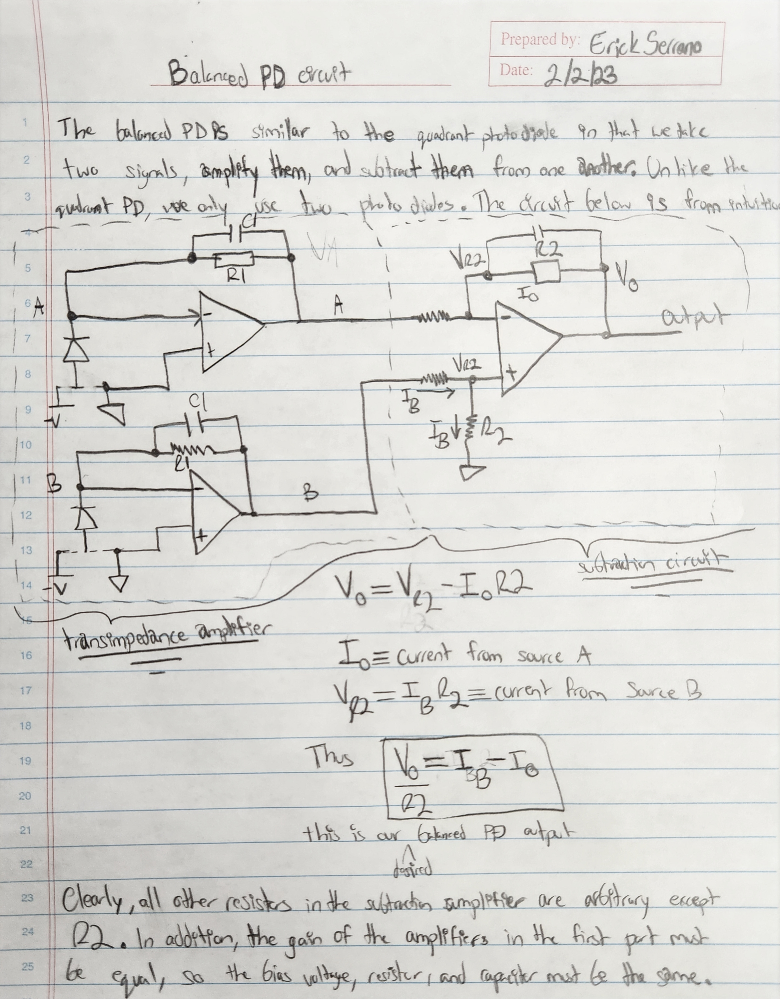

# Progress Report for 1/24,1/26, 1/31, 2/2, 2/3

These past two weeks I have completed the following objectives:
1. Completed the Quadratic Photodiode Circuit`*`
2. Completed the Quadratic Photodiode PCB Design`*`
3. Derived the circuit for the balanced photodiode 
4. Completed Presentation for student meeting on (2/3)

`*` Completed these objectives with the help of Dr. Zhou

[From the previous week's notes](https://github.com/erickserr125/phys493/blob/main/notes/(Spring%202023)%20PHYS493%20Notes%20(4).md), I demonstrated my version of the quadratic photodiode on kicad, where I used a total of 7 amplifiers (4 for amplification and 3 to detect the shift/stretch in the light) and 4 photodiode signals to construct the quadrant photodiode circuit. However, there were some issues with the connections that Dr. Zhou pointed out. In the end, I used the schematic shown below:

From there, I worked on a (quite messy) PCB board, which I was later able to optimize once again with Dr. Zhou's help. He has given me tips and modified the PCB board to make it clean and very readable. The PCB board is below:

Finally, I worked on deriving the balanced PD circuit. Dr. Zhou mentioned that the circuit operated similarly to a quadrant photodiode circuit, except we only use two signals to perform subtraction instead of four. The balanced PD is useful for determining the difference in intensity between two signals. Below is my circuit with a derivation of the difference between the signals (using currents):

[I also worked on a presentation](https://docs.google.com/presentation/d/1H4CKk13rdgLbGSSVKGHJWgV10WITVyi8yn0zu9APpAA/edit?usp=sharing) (which I will be presenting on 2/3/2023) which showcases my progress thus far. This concludes my progress. 
