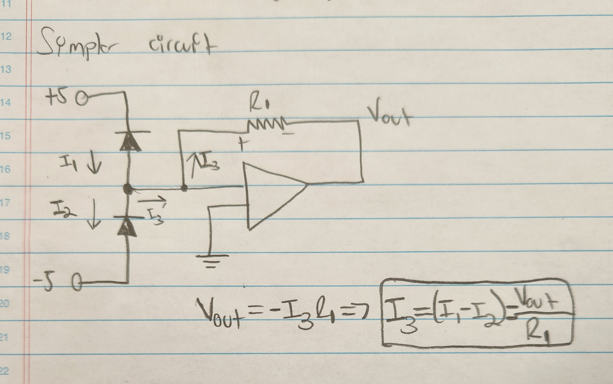
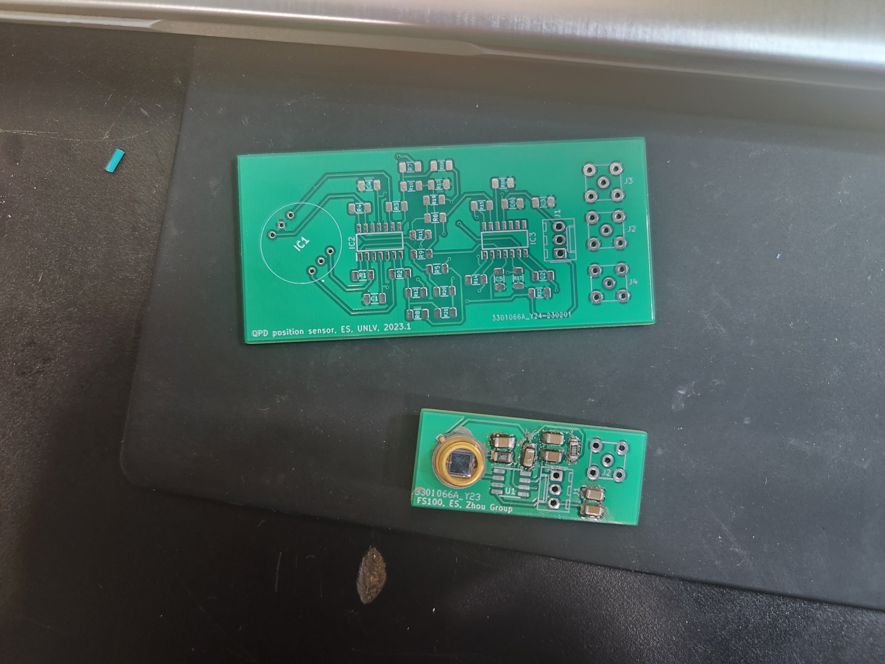

# Progress Report for (1/7,1/9)

This past week I made much more progress than usual. I developed a PCB design for the first balanced PD schematic, which used a similar setup as the quadrant photodiode. The image is shown in [last week's progress report](https://github.com/erickserr125/phys493/blob/main/notes/(Spring%202023)%20PHYS493%20Notes%20(5).md). This PCB was fairly simple compared to the quadrant photodiode but slightly more complicated than the simple PD circuit. In addition, this circuit had two layers, since we had to convert the circuit to a measurable voltage and then subtract the signals from one another. 

It turns out that there is a simpler way to implement the balanced photodiode circuit. We show our schematic below:

We are hoping to implement this schematic in the coming weeks. It is clearly much simpler, which surely implies an improvement in speed. Finally, we began soldering the PCB parts for the simple photodiode circuit and the quadrant photodiode circuit. The image of part of the progress is shown below: 

We had some issues with testing it (possibly burning the schematic), so Dr. Zhou said he would attempt to redo one himself for testing. 
