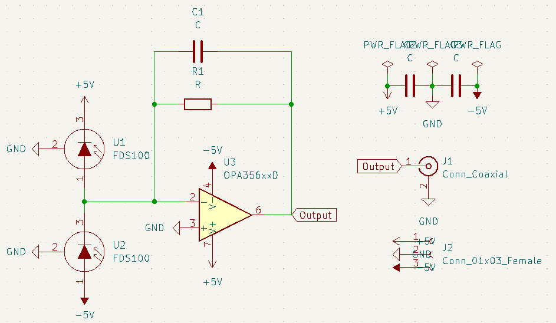
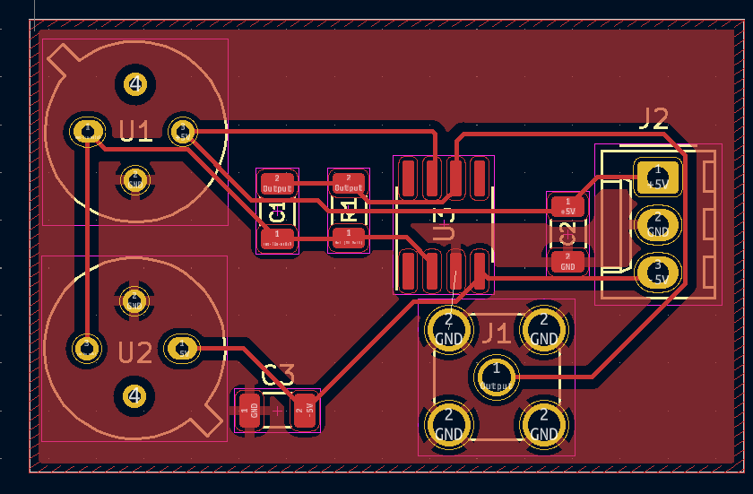

# Progress Report for (2/15,2/16)

This week, I focused on finishing the PCB design for the simple balanced photodiode. I also finished soldering the standard photodiode PCB board with proof of it working well. However, I also found that there were issues with the amplifier that I will discuss soon. 

First, I completed the PCB design for the simple balanced photodiode. I designed two schematics for the balanced photodiode because 1) The new one I designed uses less gates/ICs, and therefore should be faster and 2) the old one I designed is a simplified version of the quadrant photodiode -- which speaks to the generalization possibilities made by the quadrant photodiode. 

The resulting schematic and PCB are found below:

Finally, I completed the PCB board design with the standard photodiode. The video proof is shown below:

However, the circuit soon stopped working due to the limitations of the OPAx356 IC, which only accepts up to 5.5V difference between the positive and negative terminal of the op-amp bias. On the other hand, we need to maintain a negative bias at 5V as required by the photodiode circuit; this means we have to consider the following solutions:

1) Create another PCB design with a voltage regulator (assuming the same source goes everywhere)
2) Create another PCB design with two separate voltage sources
3) Replace the OPAx356 IC with another that can withstand higher voltage differences (assuming the same pinout). 

Clearly, option 3 is the simplest; as it turns out, there is also a circuit that exists which can replace the OPAx356, so we will pursue this option. 
